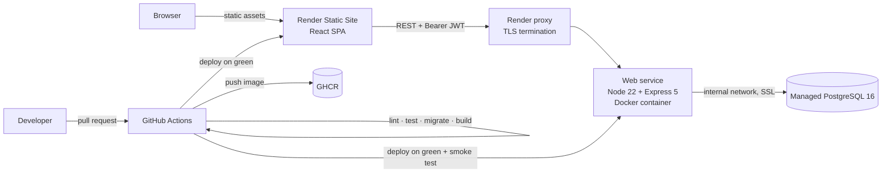

# Task Management

A full-stack task management application — a **React** web client and a **Node.js + PostgreSQL**
API, containerized with **Docker**, built and tested by **GitHub Actions**, and deployed to
**Render**.

> **Status: planning.** The backlog and tooling are in place; the applications are not built yet.
> Work is tracked across [68 issues](https://github.com/jessiicamaru/task-management/issues) in
> [nine milestones](https://github.com/jessiicamaru/task-management/milestones), starting at
> [#1](https://github.com/jessiicamaru/task-management/issues/1). Each milestone is a **vertical
> slice** — API and UI for one capability, shipped together — rather than a layer, so there is
> something demonstrable at the end of each. This README grows into the full quickstart as they land
> ([#49](https://github.com/jessiicamaru/task-management/issues/49),
> [#68](https://github.com/jessiicamaru/task-management/issues/68)).

---

## What it will do

Teams create **projects**, invite **members** with roles, and track **tasks** through a status
workflow with priorities, due dates, assignees and comments — through a web UI, or directly against
the documented API.

Each capability below is one milestone, and each one covers **both halves** — the endpoints and the
screens that use them.

| Capability | API | UI | Milestone |
| --- | --- | --- | --- |
| Accounts and sessions — register, log in, JWT with rotating refresh tokens | [#18–#24](https://github.com/jessiicamaru/task-management/milestone/3) | [#53–#55](https://github.com/jessiicamaru/task-management/milestone/3) | [M3](https://github.com/jessiicamaru/task-management/milestone/3) |
| Projects with role-based membership (`owner` / `admin` / `member` / `viewer`) | [#26](https://github.com/jessiicamaru/task-management/issues/26), [#27](https://github.com/jessiicamaru/task-management/issues/27) | [#57](https://github.com/jessiicamaru/task-management/issues/57), [#58](https://github.com/jessiicamaru/task-management/issues/58) | [M4](https://github.com/jessiicamaru/task-management/milestone/4) |
| Tasks — filtering, sorting, keyset pagination, status rules, comments | [#28–#32](https://github.com/jessiicamaru/task-management/milestone/5) | [#59–#62](https://github.com/jessiicamaru/task-management/milestone/5) | [M5](https://github.com/jessiicamaru/task-management/milestone/5) |
| OpenAPI 3.1 reference served by the API | [#32](https://github.com/jessiicamaru/task-management/issues/32) | — | [M5](https://github.com/jessiicamaru/task-management/milestone/5) |

## Repository layout

```
task-management/
  server/          # Express 5 + PostgreSQL API      → its own package.json, Dockerfile, tests
  web/             # React 19 + Vite + TypeScript UI → its own package.json, tests
  docker/          # entrypoint, postgres init  (compose lives at the root)
  docs/            # deployment guide, database notes, ADRs
  scripts/         # repo-level maintenance scripts
  local/           # gitignored scratch space
  .claude/skills/  # project workflow skills (issues, PRs, review, setup)
  .specify/        # Spec Kit templates and scripts
```

Each application is self-contained. `web/` never imports from `server/` — it talks to it over HTTP,
which is the same contract any other client would get.

## Architecture



The pipeline is as much of the project as the application is. CI gates every pull request, the image
is built and smoke-tested before it is published, and **deployment happens only after CI is green** —
Render's own auto-deploy is deliberately turned off, because it fires on push regardless of whether
the tests passed ([#45](https://github.com/jessiicamaru/task-management/issues/45),
[#46](https://github.com/jessiicamaru/task-management/issues/46)).

### Stack

| | Choice |
| --- | --- |
| **API** | Node.js 22 (ESM), Express 5, `pg`, `node-pg-migrate`, zod, pino |
| **Auth** | argon2id passwords, HS256 JWT access tokens, opaque hashed refresh tokens with rotation and reuse detection |
| **Web** | React 19, TypeScript, Vite, React Router, TanStack Query, React Hook Form + zod, Tailwind |
| **Database** | PostgreSQL 16 |
| **Tests** | Vitest + Supertest (API), Vitest + Testing Library + Playwright (web) |
| **Container** | Multi-stage Alpine image, non-root, tini as PID 1 |
| **CI/CD** | GitHub Actions → GHCR → Render (web service + static site) |

## Quickstart

> Available once [M6](https://github.com/jessiicamaru/task-management/milestone/6) lands. Written
> here so the target is explicit.

```bash
cp .env.example .env
docker compose up --build          # postgres + api + web

docker compose exec api npm run migrate:up
docker compose exec api npm run seed

curl localhost:3000/healthz        # API
open http://localhost:5173         # UI
```

## Roadmap

Milestones are **vertical slices**, not layers: M3 is not "the auth API", it is accounts and
sessions working from the login form through to the database. The first two are necessarily
foundational, and everything after them ends with something you can click.

Issues within a milestone are ordered by dependency and each carries a `Depends on #N` line, so
`/gh-issues --next` can tell you what is actually ready to start.

| Milestone | Server | Web | Ships |
| --- | --- | --- | --- |
| [M1 Foundations](https://github.com/jessiicamaru/task-management/milestone/1) | #1–#9, #25 | #51, #56 | Both apps boot, with config, logging, the error contract, health checks and design tokens |
| [M2 Data layer and API client](https://github.com/jessiicamaru/task-management/milestone/2) | #10–#17 | #52 | Schema, migrations and seed data; the single typed client every screen calls through |
| [M3 Auth end-to-end](https://github.com/jessiicamaru/task-management/milestone/3) | #18–#24 | #53–#55 | **Sign up, sign in, stay signed in** — protected routes over rotating refresh tokens |
| [M4 Projects end-to-end](https://github.com/jessiicamaru/task-management/milestone/4) | #26, #27 | #57, #58 | **Create a project, invite a colleague** — the role matrix, enforced and rendered |
| [M5 Tasks end-to-end](https://github.com/jessiicamaru/task-management/milestone/5) | #28–#32 | #59–#62 | **The product** — board, filters, transitions, comments, and the API reference |
| [M6 Containerization and local stack](https://github.com/jessiicamaru/task-management/milestone/6) | #37–#40 | #65 | `docker compose up` runs the whole thing |
| [M7 Testing and quality gates](https://github.com/jessiicamaru/task-management/milestone/7) | #33–#36 | #63 | Integration, component and Playwright coverage with enforced thresholds |
| [M8 CI pipeline](https://github.com/jessiicamaru/task-management/milestone/8) | #41–#44 | #64 | Every PR linted, tested, built and scanned — with monorepo path filters |
| [M9 Deploy and docs](https://github.com/jessiicamaru/task-management/milestone/9) | #45–#50 | #66–#68 | Live on Render, deployed on green, documented end to end |

## Working on this repo

The repository ships with Claude Code skills that encode these conventions, so the tooling and the
codebase cannot drift apart.

| Skill | What it does |
| --- | --- |
| `/gh-issues` | Browse the backlog. `--next` reports what is **ready**, what is **blocked by an open dependency**, and what is already assigned. |
| `/gh-issue-create` | File an issue with the right Conventional Commit title, `type:` / `area:` / `risk:` labels and milestone — and insists on evidence rather than a description. |
| `/gh-pr-create` | Open a PR: base branch, description from the template, linked issue, labels and badges. |
| `/gh-pr-review` | Review a PR through security / bugs / contracts / tests / quality / docs lenses, against this stack's real failure modes. |
| `/gh-setup` | One-time GitHub access setup, plus the label taxonomy and milestones. |

Spec Kit workflows (`/speckit-specify`, `/speckit-plan`, `/speckit-tasks`, `/speckit-implement`) live
under [.specify/](.specify/) for work large enough to deserve a spec rather than a ticket.

### Conventions

- **Commits** — Conventional Commits with a scope from
  `api, auth, users, projects, tasks, db, config, health, web, ui, docker, ci, deploy, docs, test`.
- **Branches** — `<type>/<issue-number>-<slug>`, e.g. `feat/14-jwt-login`. Including the number lets
  the PR tooling link the issue automatically.
- **Labels** — exactly one `type:`, one or more `area:`, `risk:` only when true, `size:` on PRs only.
- **Environment variables** — a new variable is added to `.env.example`, the compose file **and**
  the Render dashboard in the same change. A variable that exists in code and nowhere in Render is a
  deploy that boots and then dies.
- **Migrations** — expand, deploy, backfill, contract. Render rolls a new instance in while the old
  one still serves traffic, so a migration that drops a column the running code selects breaks
  production *during* the rollout.
- **CORS and `VITE_API_URL` are a pair.** Changing where either app is hosted means changing both,
  in the same PR.

The contributor guide and ADR log land in
[#50](https://github.com/jessiicamaru/task-management/issues/50); decisions already made are indexed
in [docs/adr/](docs/adr/).

## License

MIT — see [LICENSE](LICENSE).
