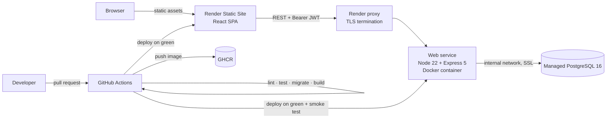

# Task Management

A full-stack task management application — a **React** web client and a **Node.js + PostgreSQL**
API, containerized with **Docker**, built and tested by **GitHub Actions**, and deployed to
**Render**.

> **Status: planning.** The backlog and tooling are in place; the applications are not built yet.
> Work is tracked across [the issues](https://github.com/jessiicamaru/task-management/issues) in
> [milestones M1–M10](https://github.com/jessiicamaru/task-management/milestones), starting at
> [#1](https://github.com/jessiicamaru/task-management/issues/1). This README grows into the full
> quickstart as those land ([#49](https://github.com/jessiicamaru/task-management/issues/49)).

---

## What it will do

Teams create **projects**, invite **members** with roles, and track **tasks** through a status
workflow with priorities, due dates, assignees and comments — through a web UI, or directly against
the documented API.

| Capability | Tracked in |
| --- | --- |
| Register, log in, JWT access tokens with rotating refresh tokens | [M3](https://github.com/jessiicamaru/task-management/milestone/3) |
| Projects with role-based membership (`owner` / `admin` / `member` / `viewer`) | [#26](https://github.com/jessiicamaru/task-management/issues/26), [#27](https://github.com/jessiicamaru/task-management/issues/27) |
| Tasks with filtering, sorting and keyset pagination | [#28](https://github.com/jessiicamaru/task-management/issues/28), [#29](https://github.com/jessiicamaru/task-management/issues/29) |
| Status transition rules, assignment, comments | [#30](https://github.com/jessiicamaru/task-management/issues/30), [#31](https://github.com/jessiicamaru/task-management/issues/31) |
| OpenAPI 3.1 reference served by the API | [#32](https://github.com/jessiicamaru/task-management/issues/32) |
| Web client: auth, project views, task board, task detail | [M9](https://github.com/jessiicamaru/task-management/milestone/9) |

## Repository layout

```
task-management/
  server/          # Express 5 + PostgreSQL API      → its own package.json, Dockerfile, tests
  web/             # React 19 + Vite + TypeScript UI → its own package.json, tests
  docker/          # entrypoint, postgres init  (compose lives at the root)
  docs/            # deployment guide, database notes, ADRs
  scripts/         # repo-level maintenance scripts
  local/           # gitignored scratch space
  .claude/skills/  # project workflow skills (issues, PRs, review, setup)
  .specify/        # Spec Kit templates and scripts
```

Each application is self-contained. `web/` never imports from `server/` — it talks to it over HTTP,
which is the same contract any other client would get.

## Architecture



The pipeline is as much of the project as the application is. CI gates every pull request, the image
is built and smoke-tested before it is published, and **deployment happens only after CI is green** —
Render's own auto-deploy is deliberately turned off, because it fires on push regardless of whether
the tests passed ([#45](https://github.com/jessiicamaru/task-management/issues/45),
[#46](https://github.com/jessiicamaru/task-management/issues/46)).

### Stack

| | Choice |
| --- | --- |
| **API** | Node.js 22 (ESM), Express 5, `pg`, `node-pg-migrate`, zod, pino |
| **Auth** | argon2id passwords, HS256 JWT access tokens, opaque hashed refresh tokens with rotation and reuse detection |
| **Web** | React 19, TypeScript, Vite, React Router, TanStack Query, React Hook Form + zod, Tailwind |
| **Database** | PostgreSQL 16 |
| **Tests** | Vitest + Supertest (API), Vitest + Testing Library + Playwright (web) |
| **Container** | Multi-stage Alpine image, non-root, tini as PID 1 |
| **CI/CD** | GitHub Actions → GHCR → Render (web service + static site) |

## Quickstart

> Available once [M6](https://github.com/jessiicamaru/task-management/milestone/6) lands. Written
> here so the target is explicit.

```bash
cp .env.example .env
docker compose up --build          # postgres + api + web

docker compose exec api npm run migrate:up
docker compose exec api npm run seed

curl localhost:3000/healthz        # API
open http://localhost:5173         # UI
```

## Roadmap

Each milestone is a shippable slice. Issues within one are ordered by dependency and each carries a
`Depends on #N` line, so `/gh-issues --next` can tell you what is actually ready to start.

| Milestone | Scope |
| --- | --- |
| [M1 Foundation](https://github.com/jessiicamaru/task-management/milestone/1) | Scaffold, config, logging, HTTP shell, errors, health, graceful shutdown |
| [M2 Database](https://github.com/jessiicamaru/task-management/milestone/2) | Pool, migrations, schema, indexes, transactions, seed |
| [M3 Auth](https://github.com/jessiicamaru/task-management/milestone/3) | Hashing, register, login, JWT, refresh rotation, authorization, rate limiting |
| [M4 Core API](https://github.com/jessiicamaru/task-management/milestone/4) | Validation, projects, members, tasks, listing, transitions, comments, OpenAPI |
| [M5 Testing](https://github.com/jessiicamaru/task-management/milestone/5) | Test harness, integration suites, coverage gates |
| [M6 Containerization](https://github.com/jessiicamaru/task-management/milestone/6) | Dockerfile, image hygiene, compose, entrypoint |
| [M7 CI-CD](https://github.com/jessiicamaru/task-management/milestone/7) | CI, image smoke test, GHCR publish, scanning, deploy |
| [M8 Deploy and Docs](https://github.com/jessiicamaru/task-management/milestone/8) | Render blueprint, production hardening, deployment guide, docs |
| [M9 Frontend](https://github.com/jessiicamaru/task-management/milestone/9) | React app: API client, auth, projects, task board, comments, design system, tests |
| [M10 Full-stack Integration](https://github.com/jessiicamaru/task-management/milestone/10) | Compose with the web app, CI path filters, static site deploy, end-to-end docs |

## Working on this repo

The repository ships with Claude Code skills that encode these conventions, so the tooling and the
codebase cannot drift apart.

| Skill | What it does |
| --- | --- |
| `/gh-issues` | Browse the backlog. `--next` reports what is **ready**, what is **blocked by an open dependency**, and what is already assigned. |
| `/gh-issue-create` | File an issue with the right Conventional Commit title, `type:` / `area:` / `risk:` labels and milestone — and insists on evidence rather than a description. |
| `/gh-pr-create` | Open a PR: base branch, description from the template, linked issue, labels and badges. |
| `/gh-pr-review` | Review a PR through security / bugs / contracts / tests / quality / docs lenses, against this stack's real failure modes. |
| `/gh-setup` | One-time GitHub access setup, plus the label taxonomy and milestones. |

Spec Kit workflows (`/speckit-specify`, `/speckit-plan`, `/speckit-tasks`, `/speckit-implement`) live
under [.specify/](.specify/) for work large enough to deserve a spec rather than a ticket.

### Conventions

- **Commits** — Conventional Commits with a scope from
  `api, auth, users, projects, tasks, db, config, health, web, ui, docker, ci, deploy, docs, test`.
- **Branches** — `<type>/<issue-number>-<slug>`, e.g. `feat/14-jwt-login`. Including the number lets
  the PR tooling link the issue automatically.
- **Labels** — exactly one `type:`, one or more `area:`, `risk:` only when true, `size:` on PRs only.
- **Environment variables** — a new variable is added to `.env.example`, the compose file **and**
  the Render dashboard in the same change. A variable that exists in code and nowhere in Render is a
  deploy that boots and then dies.
- **Migrations** — expand, deploy, backfill, contract. Render rolls a new instance in while the old
  one still serves traffic, so a migration that drops a column the running code selects breaks
  production *during* the rollout.
- **CORS and `VITE_API_URL` are a pair.** Changing where either app is hosted means changing both,
  in the same PR.

The contributor guide and ADR log land in
[#50](https://github.com/jessiicamaru/task-management/issues/50); decisions already made are indexed
in [docs/adr/](docs/adr/).

## License

MIT — see [LICENSE](LICENSE).
